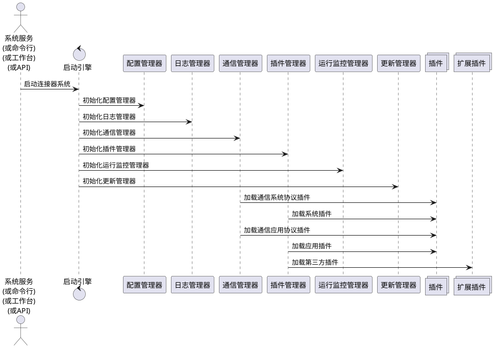
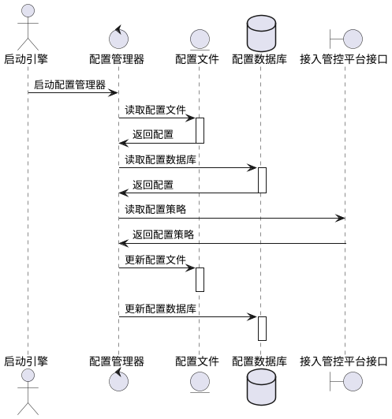
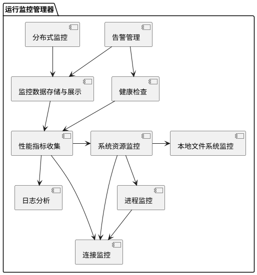
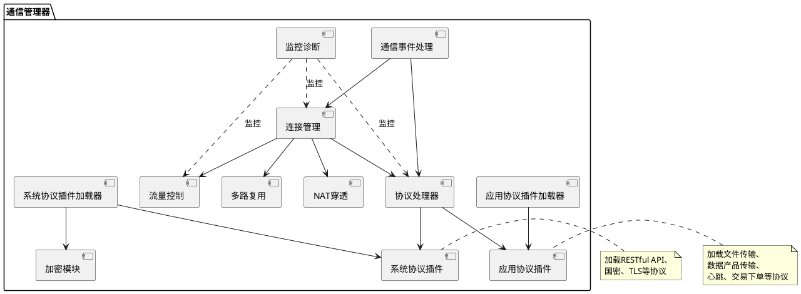
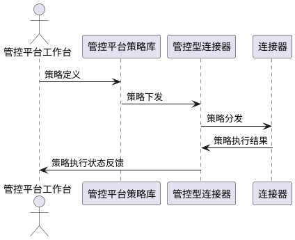
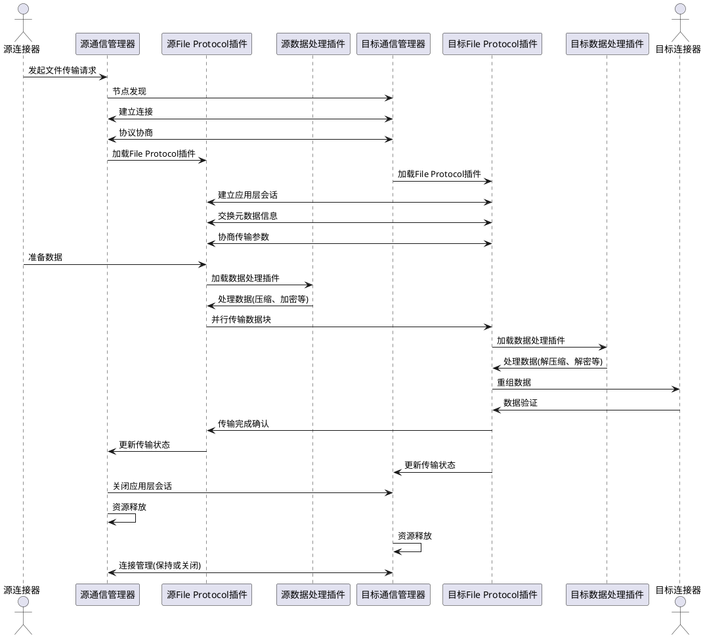
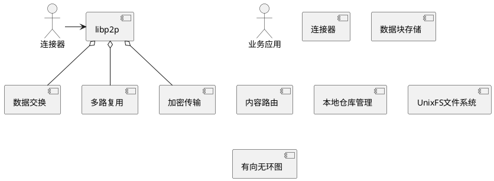

# 4. 技术架构

## 4.1 技术架构图
### 4.1.1 架构拓扑模式

组网架构拓扑模式有：级联模式、中心注册P2P模式、全对等P2P模式以及混合P2P模式等四种类型
本项目将改变传统的级联模式为P2P模式，各模式对比如下

基于共享域的混合P2P组网架构，支撑各种技术路线的数据流通利用平台
连接器安装在接入点、底座、管理平台、物联网终端上
未安装连接器的可通过Http-Proxy对接服务

## 4.2 连接器分层架构

@import "./04-2连接器技术架构分层图.md"

连接器采用分层架构设计,主要包括以下几层:

1. 资源层
   - 存储管理:管理连接器系统的存储资源 (P2)
   - 计算管理:管理连接器系统的计算资源 (P2)
   - 网络管理:管理连接器系统的网络资源 (P2)
   - 文件管理:管理连接器系统的文件资源 (P2)
   - 证书管理:管理连接器系统的证书资源 (P0)
   - 密钥管理:管理连接器系统的密钥资源 (P0)

2. 核心引擎层
   - 启动引擎:负责系统初始化和启动  (P0)
   - 配置管理:处理系统配置和参数设置  (P0)
   - 日志管理:记录系统运行日志  (P0)
   - 消息管理:处理系统消息和事件  (P0)
   - 安全管理:负责系统安全管理  (P0)
   - 通信管理:管理P2P网络通信  (P0)
   - 插件管理:管理各类插件的加载和生命周期  (P1)
   - 更新管理:管理系统的更新和版本管理  (P1)

3. 插件层
   - 系统插件:
     - 权限控制: 管理系统访问权限 (P0)
     - 计量计费: 记录资源使用情况并计费 (P1)
     - 身份管理: 处理用户身份验证和授权 (P0)
   - 应用插件:
     - 数据资源管理: 管理各类数据资源 (P0)
     - 数据产品管理: 管理数据产品的生命周期 (P0)
     - 数据目录管理: 维护数据资源目录 (P1)
     - 数据交付传输: 处理数据的交付和传输 (P0)
     - 交易签约管理: 管理数据交易合同 (P1)
   - 通信系统协议插件:
     - RESTfulAPI协议: 支持RESTful API通信 (P0)
     - 国密协议: 实现国密算法通信 (P1)
     - TLS协议: 提供安全传输层 (P0)
   - 通信应用协议插件:
     - 文件传输协议: 处理文件传输 (P0)
     - 数据产品传输协议: 专用于数据产品传输 (P1)
     - 心跳协议: 维持连接状态 (P0)
     - 交易下单协议: 处理交易订单 (P1)
   - 第三方插件:
     - 隐私计算插件: 支持隐私计算功能 (P1)

4. 接入层 
   - Go SDK:为Go语言提供集成接口 (P0)
   - 多语言SDK:为Java、Python、主流编程语言提供集成接口
   - 统一抽象:在不同语言SDK中提供一致的抽象和接口设计
   - 示例代码:提供丰富的示例代码和使用说明文档

5. 接口层 
   - API接口:提供RESTful API供外部系统调用 (P0)
   - 命令行接口:提供命令行工具进行系统管理 (P1)
   - 接口版本管理:管理不同版本的API接口 (P2)

### 4.2.2 启动引擎 

启动引擎负责连接器系统的初始化和启动过程。

a. 启动核心系统组件
   包括配置管理、日志管理、插件管理、更新管理器， 运行监控管理器等基础组件的初始化。

b. 启动通信模块  
   初始化P2P通信管理器和各种通信插件。

c. 启动系统级插件模块
   按顺序启动系统插件

d. 启动非系统插件模块

e. 启动运行监控管理器的运行监控，进行状态检查与监控
   执行系统状态检查,确保各组件正常运行。

f. 启动命令行接口
   初始化命令行管理器,提供交互式操作接口。

启动引擎通过有序执行上述步骤,确保连接器系统各组件正常初始化和启动,为后续的业务功能提供基础支撑。

以下是使用PlantUML描述的启动引擎启动过程:

### 4.2.3 配置管理器

配置管理器负责管理连接器系统的各项配置,主要包括以下功能:

1. 配置加载
   * 支持3层策略配置，包括底座配置、组织配置、本地配置
   * 管控平台配置：包括底座基础支撑平台（远端配置中心）的策略等
   * 组织配置：包括组织策略、组织间策略等
   * 本地配置：包括本地文件系统等
   * 按优先级加载配置,支持配置覆盖机制
   * 解析不同格式的配置文件,如YAML、JSON、TOML等

2. 配置缓存
   * 将加载的配置存储在内存中,提高访问速度
   * 支持配置项的懒加载,按需加载特定模块的配置

3. 动态配置更新
   * 支持运行时动态修改配置，以及管控平台配置更新
   * 提供配置变更事件通知机制,允许其他模块订阅配置变更

4. 配置验证
   * 定义配置项的数据类型、取值范围等约束条件
   * 在加载和更新配置时进行合法性检查

5. 配置版本管理
   * 记录配置的修改历史
   * 支持配置回滚到之前的版本

6. 配置导出与导入
   * 支持将当前配置导出为文件
   * 允许从外部文件导入配置,便于配置迁移和备份

7. 配置访问接口
    * 提供统一的配置访问API
    * 支持按模块、类别等方式组织和访问配置项

配置管理器通过以上功能,确保连接器系统的配置管理灵活、安全、高效,为系统的稳定运行和易维护性提供支持。

以下是配置管理器的时序图设计:

### 4.2.3 日志管理器

日志管理器负责处理连接器系统的日志记录、存储和分析,主要包括以下功能:

1. 日志记录
   * 支持多种日志级别(如DEBUG、INFO、WARN、ERROR等)
   * 提供统一的日志记录接口,方便系统各模块调用
   * 记录详细的日志信息,包括时间戳、日志级别、模块名、线程ID等

2. 日志存储 (P1)
    * 支持日志文件的滚动和压缩
    * 支持日志文件的存储和查询

3. 日志分析 (P2)

4. 日志安全  (P2)

5. 远程日志收集  (P2)

6. 日志性能优化 (P2)

7. 日志配置 (P2)
   * 支持动态调整日志级别和输出目标
   * 提供灵活的日志格式配置选项

8. 日志监控告警 (P2)
   * 设置日志监控规则,检测异常日志模式
   * 集成告警系统,及时通知管理员

9. 日志留存策略 (P2)
   * 实现日志自动清理机制,根据配置删除过期日志
   * 支持重要日志的长期存档

### 4.2.4 运行监控管理器

运行监控管理器负责监控和管理连接器系统的运行状态,主要包括以下功能:

1. 系统资源监控 (P0)
   * 监控CPU、内存、磁盘、网络等系统资源使用情况
   * 设置资源使用阈值,超过阈值时触发告警

2. 进程监控 (P1)
   * 监控关键进程的运行状态
   * 检测进程是否异常退出,并支持自动重启

3. 连接监控 (P0)
   * 监控P2P网络连接状态和网络流量
   * 监控连接器与本地文件管理器、数据源管理器、API管理器、应用系统等模块的连接状态
   * 监控网络连接状态和网络流量
   * 检测网络异常和丢包情况

4. 本地文件系统监控 (P1)
   * 监控本地文件系统的使用情况
   * 监控文件系统的读写性能

4. 性能指标收集 (P1)
   * 收集系统关键性能指标,如请求响应时间、吞吐量等
   * 支持自定义性能指标的收集

5. 日志分析 (P1)
   * 实时分析系统日志,检测异常情况
   * 支持基于日志的告警规则配置

6. 健康检查 (P1)
   * 定期执行系统各模块的健康检查
   * 提供健康检查API,支持外部系统调用

7. 告警管理 (P2)
   * 支持多种告警方式,如邮件、短信、webhook等
   * 实现告警级别管理和告警抑制机制

8. 监控数据存储与展示 (P2)
   * 将监控数据存储到时序数据库
   * 提供监控数据的可视化展示界面

9. 自动化运维 (P2)
   * 支持基于监控数据的自动化运维操作
   * 实现简单的故障自愈功能

10. 分布式监控 (P3)
   * 支持多节点的分布式监控
   * 实现监控数据的汇总和分析

运行监控管理器通过以上功能,确保连接器系统的稳定运行,及时发现和解决潜在问题,提高系统的可靠性和可维护性。

以下是运行监控管理器的组件关系图:

### 4.2.5 通信管理器

通信管理器负责处理连接器系统的网络通信,基于libp2p实现P2P通信功能,主要包括以下功能:

- P2P网络管理框架:管理P2P网络各组件块
- 节点身份管理:管理节点身份和权限
- 通信协议:处理各种网络协议(如TCP, UDP, WebRTC等)
- 节点发现:实现网络中的节点发现机制
- 节点管理:管理节点状态和行为
- 节点加密:管理节点之间的加密通信
- 消息路由:管理消息的发送和接收
- NAT穿越:实现NAT穿越机制
- 中继服务:提供中继服务,实现节点之间的通信
- 协议协商:实现节点之间的协议协商机制
- 连接管理:管理节点之间的连接和断开
- 通信应用协议插件:支持自定义的应用层协议
    o 数据加密插件:实现数据加密和解密
    o 数据压缩插件:实现数据压缩和解压缩
    o 心跳检测插件:实现节点之间的心跳检测机制
    o HTTP网关插件:将P2P网络转换为HTTP服务

1. 初始化libp2p节点 (P0)
   * 配置并启动libp2p节点
   * 按照策略生成节点ID
   * 按照策略加载或者生成密钥对
   * 设置监听地址和协议

2. 节点发现与连接 (P1)
   * 实现DHT(分布式哈希表)用于节点发现
   * 支持多种节点发现机制,如mDNS、KAD等
   * 管理与其他节点的连接池 (P1)

3. 协议支持 (P1)
   * 实现多种通信协议,如TCP、WebRTC、QUIC等 (P1)
   * 支持协议协商,选择最优通信方式 (P1)

4. 消息路由 (P1)
   * 实现基于内容寻址的消息路由
   * 支持直接消息和中继消息传输

5. 安全通信 (P1)
   * 使用TLS加密所有通信内容
   * 使用签名机制验证消息来源
   * 使用加密算法保护消息内容
   * 实现节点身份验证机制
   * 支持访问控制列表(ACL)
   * 使用国密算法

6. NAT穿透 (P1)
   * 实现STUN、TURN等NAT穿透技术
   * 支持UPnP端口映射

7. 流量控制 (P2)
   * 实现带宽限制和流量整形
   * 支持服务质量(QoS)管理

8. 多路复用 (P0)
   * 在单个连接上支持多个逻辑流
   * 实现流的优先级管理

9. 事件处理 (P0)
   * 提供异步事件处理机制
   * 支持自定义事件回调 (P0)

10. 监控与诊断 (P2)
    * 收集并报告网络性能指标 (P2)
    * 提供网络诊断工具 (P2)

11. 加载通信系统协议插件 (P2)
    * 支持动态加载和卸载系统协议插件 (P2)
    * 提供标准化的插件接口,便于开发者扩展自定义协议 (P2)
    * 实现插件版本管理,支持多版本共存 (P2)
    * 提供插件运行时隔离,确保系统稳定性 (P2)
    * 支持插件热更新,无需重启系统即可更新插件 (P2)
    * 实现插件依赖管理,自动解决插件间的依赖关系 (P2)
    * 提供插件性能监控和资源管理功能 (P2)
    * 支持插件配置管理,允许动态调整插件参数 (P2)
    * 实现插件安全检查机制,防止恶意插件危害系统 (P2)
    * 提供插件开发SDK和文档,降低开发者的学习成本 (P2)

12. 加载通信应用协议插件 (P2)
    * 支持动态加载和卸载应用协议插件 (P2)
    * 提供标准化的插件接口,便于开发者扩展自定义协议 (P2)
    * 实现插件版本管理,支持多版本共存 (P2)
    * 提供插件运行时隔离,确保系统稳定性 (P2)
    * 支持插件热更新,无需重启系统即可更新插件 (P2)
    * 实现插件依赖管理,自动解决插件间的依赖关系 (P2)
    * 提供插件性能监控和资源管理功能 (P2)
    * 支持插件配置管理,允许动态调整插件参数 (P2)
    * 实现插件安全检查机制,防止恶意插件危害系统 (P2)
    * 提供插件开发SDK和文档,降低开发者的学习成本 (P2)

通信管理器通过以上功能,为连接器系统提供可靠、安全、高效的P2P通信基础设施。

通信管理器的组件关系图如下:

### 4.2.6 插件管理器
插件管理器负责连接器系统中各类插件的生命周期管理,主要包括以下功能:

1. 插件加载
   * 支持动态加载插件,无需重启系统
   * 实现插件依赖管理,自动解析和加载依赖项
   * 提供插件加载优先级设置,确保核心插件优先加载

2. 插件初始化
   * 执行插件的初始化方法,完成插件的启动准备
   * 为插件分配必要的系统资源
   * 注册插件提供的服务和扩展点

3. 插件运行时管理
   * 监控插件的运行状态,包括CPU使用率、内存占用等
   * 实现插件间的通信机制,支持事件订阅和发布
   * 提供插件配置热更新能力,无需重启即可修改插件参数

4. 插件版本管理
   * 支持多版本插件共存,实现平滑升级
   * 维护插件版本信息,支持版本回退
   * 通过P2P网络同步插件版本信息

5. 插件卸载
   * 支持动态卸载插件,释放相关资源
   * 确保插件卸载时不影响系统稳定性
   * 处理插件间的依赖关系,防止误卸载被依赖的插件

6. 插件安全管理
   * 实现插件签名验证机制,确保插件来源可信
   * 提供插件沙箱环境,隔离插件运行空间
   * 实现插件权限控制,限制插件对系统资源的访问

7. 插件开发支持
   * 提供标准化的插件接口和SDK
   * 支持插件热重载,方便开发者快速迭代
   * 提供插件调试工具和日志收集功能

8. 插件市场集成
   * 对接P2P网络中的插件市场
   * 支持插件在线搜索、下载和安装
   * 实现插件评分和评论系统,方便用户选择高质量插件

9. 插件性能优化
   * 实现插件懒加载机制,按需加载插件
   * 支持插件预加载,提高系统启动速度
   * 提供插件性能分析工具,帮助开发者优化插件代码

10. 插件更新管理
    * 通过P2P网络检查插件更新
    * 支持插件自动更新和手动更新
    * 实现插件增量更新,减少更新数据传输量

插件管理器通过以上功能,为连接器系统提供灵活、安全、高效的插件管理机制,支持系统功能的动态扩展和定制化需求。

### 4.2.7 更新管理器

更新管理插件负责连接器系统的版本更新和维护,主要包括以下功能:

* 版本检查
   * 定期检查连接器系统的当前版本
   * 连接P2P网络中的更新节点,获取当前操作系统环境的最新版本信息的CID
   * 比对版本号,判断是否需要更新

* 更新包下载
   * 使用P2P网络的内容寻址功能,通过CID在P2P网络中查找更新包
   * 采用分布文件系统的分片机制,将更新包分割成多个小块
   * 并行从多个节点下载不同的数据块,提高下载速度
   * 使用CID验证每个数据块的完整性和真实性

* 更新安装
   * 重组下载的数据块,还原完整的更新包
   * 解压更新包,准备安装环境
   * 备份当前系统文件和数据
   * 按照预定义的更新脚本执行安装过程
   * 更新系统文件、配置文件和数据库结构

* 回滚机制
   * 在更新过程中出现错误时,能够自动回滚到之前的稳定版本
   * 恢复备份的文件和数据,确保系统可以继续正常运行

* 更新日志
   * 记录每次更新的详细过程,包括版本号、CID、更新时间、更新内容等
   * 将更新日志存储到本地,同时通过P2P网络同步到其他管控节点

* 差量更新
   * 利用分布式文件系统的去重特性,只下载系统中不存在的数据块
   * 通过比较新旧版本的CID树,识别需要更新的部分
   * 仅传输和安装变化的数据块,减少网络带宽使用

* 自动/手动更新控制
   * 提供自动更新和手动更新两种模式
   * 允许管理员设置更新策略,如更新时间窗口、更新频率等
   * 支持通过P2P网络推送更新策略

* 更新通知
   * 在P2P网络中订阅更新通知主题
   * 当有新版本发布时,接收包含新版本CID的通知消息
   * 提供更新说明,包括新功能介绍、bug修复列表等

### 4.2.8 身份管理

身份管理插件负责连接器系统中的身份认证、授权和管理,主要包括以下功能:
* 身份认证
    * 多因素认证
    * 基于证书的认证
* 授权管理
    * 基于角色的访问控制(RBAC)
    * 基于属性的访问控制(ABAC) 
* 身份生命周期管理
* 联盟身份管理
    * 联盟身份同步
    * 跨域身份互认
    * 分布式身份(DID)支持
* 身份安全
    * 身份加密存储
    * 身份信息脱敏
    * 异常行为检测
    * 身份防伪和防冒用

### 4.2.9 数据资源管理
数据资源管理插件负责管理连接器系统中的数据资源,主要包括以下功能:

* 数据资源注册
    * 支持多种数据源类型的注册,如数据库、文件、API等
    * 收集数据源的元数据信息,如数据结构、数据量、更新频率等
    * 为注册的数据资源分配唯一标识符

* 元数据管理
    * 维护数据资源的详细元数据信息
    * 支持自定义元数据属性
    * 提供元数据的版本控制和变更历史

* 数据资源发布
    * 数据资源审核
        * 对拟发布的数据资源进行合规性审核,包括数据质量、隐私保护等方面
        * 支持多级审核流程,可配置审核规则和审核人员
    * 发布管理
        * 支持数据资源的版本管理,包括新版本发布、历史版本管理等
        * 提供数据资源的上架、下架、更新等操作
        * 支持设置数据资源的可见范围和访问权限

### 4.2.10 数据产品管理
数据产品管理插件负责管理连接器系统中的数据产品,主要包括以下功能:

* 数据产品创建
    * 支持基于已注册的数据资源创建数据产品
    * 支持设置数据产品的基本信息、定价策略、使用条款等

* 数据产品发布
    * 数据产品审核流程管理
    * 支持数据产品的版本控制
    * 提供数据产品的上架、下架、更新等操作

* 数据产品定价
    * 支持多种定价模式,如一次性购买、订阅制、按量计费等
    * 提供灵活的定价策略配置工具
    * 支持优惠券和促销活动管理

* 数据产品权限策略配置管理
    * 设置数据产品的访问权限和使用范围
    * 支持基于角色和属性的细粒度权限控制
    * 提供数据产品授权管理功能

Todo:
分为数据提供方和对数据产品管理，数据需求方管理可用的数据产品。

### 4.2.11 数据交付传输

数据交付传输插件负责管理连接器系统中的数据交付和传输过程,主要包括以下功能:

基于插件接口设计, 支持根据数据产品开发相应的插件。

* 传输协议支持

   * 多路复用协议传输 (P0)
     - 基于通信管理模块的多路复用功能实现
     - 支持多个数据流的并发传输
     - 实现流量控制和优先级管理

   * HTTP传输RESTful API (P0)
     - 提供标准的RESTful API接口
     - 支持HTTPS加密传输
     - 实现身份认证和授权机制

* 数据传输管理
   * 传输任务调度
     - 根据数据大小、优先级等因素进行任务调度
     - 支持断点续传和任务重试机制
   * 传输性能优化
     - 实现数据压缩和分片传输
     - 支持并行传输以提高效率

* 数据交付确认
   * 传输完整性校验
     - 使用校验和或哈希值验证数据完整性
   * 交付确认机制
     - 实现端到端的交付确认流程
     - 支持交付凭证生成和验证

#### 4.2.12 数据目录

数据目录插件负责管理连接器系统中的数据目录,主要包括以下功能:

* 数据目录注册
   * 支持数据目录的注册和发现
   * 收集数据目录的元数据信息,如名称、描述、格式、更新频率等
   * 验证数据目录信息的完整性和合规性

* 数据目录分类与标签
   * 实现多层级的数据目录分类体系
   * 支持为数据目录添加自定义标签
   * 提供基于分类和标签的快速检索功能

#### 4.2.13 交易签约

交易签约插件负责管理连接器系统中的交易签约流程,主要包括以下功能:

* 合同模板管理
   * 支持多种合同模板的创建、编辑和管理 (P0)
   * 提供合同模板版本控制功能 (P1)
   * 支持合同模板的动态参数配置 (P1)

* 签约流程管理
   * 实现完整的电子合同签署流程 (P0)
   * 支持多方签署和会签功能 (P1)
   * 提供签约进度跟踪和提醒机制 (P1)

* 电子签名
   * 集成第三方电子签名服务 (P0)
   * 支持多种签名方式,如手写签名、密钥签名等 (P1)
   * 实现签名有效性验证 (P0)

* 合同存证
   * 使用区块链技术对签署过程进行存证 (P2)
   * 支持合同文本和签署记录的加密存储 (P0)
   * 提供合同文件的完整性校验机制 (P1)

* 合同管理
   * 实现已签署合同的查询、下载和归档功能 (P0)
   * 支持合同到期提醒和续签管理 (P1)
   * 提供合同履行状态跟踪功能 (P2)

* 权限控制
   * 实现基于角色的合同访问控制 (P0)
   * 支持合同操作的审批流程 (P1)
   * 提供详细的操作日志记录 (P0)

* 接口集成
   * 提供标准化的API接口,支持与其他系统集成 (P0)
   * 实现与数据交易系统的无缝对接 (P1)

### 4.3 接入管控平台

管控平台负责连接器系统的管理和监控,主要包括以下功能:

* 接入点管理
* 数据产品目录管理
* 数据资产登记信息管理
* 身份管理
* 策略配置与下发
* 日志存证
* 运行监测
* 数据上报/获取
* 接入管控平台横向对接
* 标识管理

#### 4.3.1 接入点管理

接入点管理主要负责连接器的管理、下载、注册和引导入网等功能，具体包括以下几个方面：

* 连接器下载 (P0) 
   * 版本管理：维护不同类型和版本的连接器安装包
   * 下载链接生成：为每个连接器版本生成唯一的下载链接

* 连接器管理 (P1)
   * 连接器列表维护：记录所有已注册的连接器信息，包括ID、类型、版本、状态等
   * 连接器状态监控：实时监控连接器的在线状态、资源使用情况、性能指标等
   * 连接器配置管理：集中管理和下发连接器的配置信息
   * 连接器分组管理：支持按照不同维度（如地域、业务类型等）对连接器进行分组

* 连接器注册及身份管理
   * 注册流程：定义连接器的注册流程和所需信息
   * 身份验证：验证注册请求的合法性，防止未授权的注册
   * 信息收集：收集连接器的基本信息，如硬件配置、网络环境等
   * 注册确认：完成注册后，向连接器发送确认信息和初始配置

* 引导入网
   * 初始化配置：为新注册的连接器生成初始配置，包括网络参数、安全策略等
   * 引导节点分配：为新连接器分配合适的引导节点，协助其加入P2P网络
   * 网络发现：协助新连接器发现网络中的其他节点
   * 入网确认：监控新连接器的入网过程，确认其成功加入网络

* 安全管理
   * 访问控制：实施基于角色的访问控制，限制对接入点管理功能的访问
   * 加密通信：使用TLS等加密协议保护管理平台与连接器之间的通信
   * 审计日志：记录所有重要操作的审计日志，便于追溯和问题排查

#### 4.3.2 数据产品目录管理
数据产品目录管理主要负责管理和维护系统中的数据产品信息,为数据交易和使用提供基础支撑。具体功能包括:

* 数据产品注册
   o 支持数据提供方注册新的数据产品
   o 收集数据产品的元数据信息,如名称、描述、格式、更新频率等
   o 验证数据产品信息的完整性和合规性

* 数据产品分类与标签
   o 实现多层级的数据产品分类体系
   o 支持为数据产品添加自定义标签
   o 提供基于分类和标签的快速检索功能

* 数据产品目录展示
   o 提供友好的用户界面,展示数据产品目录
   o 支持多维度的筛选和排序功能
   o 实现数据产品详情页,展示完整的产品信息

#### 4.3.4 身份管理

#### 4.3.5 策略配置与下发
策略配置与下发模块负责管理和分发系统策略,确保各连接器按照统一的规则运行。主要功能包括:

1. 策略定义与管理
   - 支持在管控平台工作台定义多种类型的策略,如安全策略、数据处理策略、网络策略等
   - 提供策略模板,便于快速创建常用策略
   - 实现策略版本管理,支持策略的回滚和比较

2. 策略验证
   - 检查策略的语法正确性和逻辑一致性
   - 模拟策略执行效果,预估对系统的影响

3. 策略存储
   - 将定义的策略安全存储在管控平台的策略库中
   - 支持策略的加密存储和访问控制

4. 策略下发
   - 实现从管控平台到管控型连接器的策略下发
   - 提供策略下发的状态跟踪和失败重试机制

5. 策略分发
   - 管控型连接器根据策略的适用范围,将策略分发给相应的连接器
   - 支持基于连接器组、标签、地理位置等条件的精准分发
   - 实现策略分发的可靠性保证,确保所有目标连接器都能收到策略

6. 策略接收与执行
   - 连接器接收到策略后,进行本地验证和解析
   - 根据策略类型,调用相应的执行模块实施策略
   - 记录策略执行的结果和影响

7. 策略执行状态反馈
   - 连接器将策略执行的状态和结果反馈给管控型连接器
   - 管控型连接器汇总反馈信息,并上报给管控平台

以下是策略配置与下发过程的序列图:

#### 4.3.6  连接器与连接器文件传输

连接器与连接器之间通过通信管理器进行文件传输的过程如下:

1. 连接建立
   - 源连接器的通信管理器通过节点发现机制找到目标连接器
   - 通信管理器使用多路复用功能在两个连接器之间建立连接

2. 协议选择
   - 双方连接器使用协议协商机制确定使用的应用协议-file protocol
   - 如果存在相应的应用协议插件(file protocol plugin),且还未加载，则加载该插件,如果已经加载，则使用已加载的插件

3. 会话初始化
   - file protocol插件建立应用层会话,交换元数据信息
   - file protocol插件协商数据传输参数,如分片大小、并发数等

3. 数据传输
   - 源连接器准备数据
   - 源file protocol插件加载数据处理插件处理数据(如压缩、加密插件)
   - 双方file protocol插件支持并行传输多个数据块,提高传输效率
   - 目标file protocol插件加载数据处理插件处理数据（如解压缩、解密插件）
   - 目标连接器重组数据进行数据验证
   - 目标连接器向源连接器发送传输完成确认
   - 双方更新传输状态和记录

4. 会话关闭
   - 完成数据传输后,通信管理器关闭应用层会话
   - 释放相关资源

5. 连接管理
    - 通信管理器根据需要保持或关闭连接
    - 支持连接复用,用于后续的数据交换

整个过程由通信管理器协调,充分利用了其提供的功能,如安全传输、多路复用、协议协商等,实现了高效、可靠的点对点数据交换。同时,通过使用应用协议插件和数据处理插件,提供了灵活的扩展性和强大的数据处理能力。

以下是连接器与连接器之间数据传输过程的时序图:

#### 2.3.2 技术分层

#### 2.3.3 网络层
- 去中心化P2P组网
  - 基于libp2p实现点对点通信
  - 支持多个共享域,可根据用途、数据空间、安全要求等进行划分共享域
  - 实现节点间直接通信,减少中心化依赖
- 节点发现
  - 使用DHT(分布式哈希表)进行节点发现
  - 支持本地网络发现(mDNS)和引导节点列表
  - 实现节点信息的动态更新和维护
- 路由
  - 使用Kademlia DHT进行内容寻址和节点发现
  - 支持基于内容哈希的路由查找
  - 实现高效的节点间路由转发
- 连接管理
  - 支持多种传输协议(TCP, QUIC, WebRTC等)
  - 实现连接的建立、维护和断开
  - 支持连接复用和优先级管理
- 会话、流、协议多路复用
  - 基于yamux或mplex实现多路复用
  - 支持单一连接上的多个逻辑流
  - 实现不同协议的并发传输
- NAT穿透
  - 支持STUN、TURN等NAT穿透技术
  - 实现内网节点的直接连接
- 中继
  - 利用libp2p的AutoNAT和UPNP功能实现NAT穿透
  - 提供中继节点服务,支持无法直接连接的节点间通信
- 协议交换机
  - 支持多种应用层协议的动态协商和切换
  - 实现协议版本的兼容性管理
  - 提供可扩展的协议注册和处理机制
  - 支持协议的动态协商和切换
  - 实现协议的兼容性管理
  - 提供可扩展的协议注册和处理机制

#### 技术组件
- P2P网络通信组件：libp2p
- boxo：IPFS核心组件库，提供多种功能模块
  - bitswap: 用于数据块交换
  - blockstore: 用于数据块存储
  - routing: 用于内容路由
  - namesys: 用于命名系统
  - repo: 用于本地仓库管理
  - unixfs: 用于UnixFS文件系统实现
  - dag: 用于构建和操作DAG结构
- multiaddr: 用于处理网络地址
- protobuf: 用于数据序列化和反序列化
- gRPC: 用于实现远程过程调用
- WebRTC: 用于实现浏览器端的P2P通信
- NAT穿透技术: 如STUN、TURN、ICE等
- 加密库: 用于数据加密和安全通信
- 压缩库: 用于数据压缩，优化存储和传输
- 数据库连接器: 支持多种数据库类型
- 身份认证组件: 用于用户身份验证和访问控制
- 日志组件: 用于系统日志记录和分析
- 监控组件: 用于系统性能和状态监控
- IPNS: 用于实现可变地址系统
- pubsub: 用于实现发布-订阅模式的消息传递
- 版本控制组件: 用于管理数据集的不同版本
- 元数据管理组件: 用于处理和存储数据集的元信息

#### 数据集场景实现

##### 文件发布
按以下步骤实现文件的发布:
1. 准备文件
   - 使用boxo的blockstore组件将文件数据块存储到本地
   - 利用unixfs组件将文件组织成文件系统结构
2. 构建文件DAG
   - 使用boxo的dag组件构建文件的DAG结构
   - 生成文件的根CID
3. 内容路由
   - 使用boxo的routing组件更新内容路由表
   - 将文件的CID与网络位置信息关联
4. 发布文件
   - 使用IPNS协议创建新的IPNS记录，指向文件的根CID
   - 为每个新版本创建一个独立的IPNS记录
   - 维护一个指向最新版本的IPNS记录
   - 生成文件的唯一标识符(文件ID)
5. 调用底座登记功能
   - 准备登记信息，包括文件ID、根CID、版本号、发布时间等
   - 使用gRPC调用底座提供的登记服务接口
   - 等待登记确认，获取登记交易ID
6. 广播发布消息
   - 利用libp2p的pubsub功能，向网络广播文件发布消息
   - 消息中包含文件ID、版本号、根CID、登记交易ID等信息
7. 元数据管理
   - 使用protobuf序列化文件的元数据信息
   - 通过gRPC服务提供元数据查询接口
8. 版本管理
    - 每次发布新版本时，创建新的IPNS记录
    - 更新指向最新版本的IPNS记录
    - 在元数据中维护版本历史信息
通过这种方式，我们实现了文件的发布，并与底座系统进行了有效集成，确保了文件的可追溯性和完整性。同时，我们也提供了版本管理的能力，允许访问文件的不同版本。

##### 数据集发布

###### 数据集全新发布
按以下步骤实现数据集的全新发布:
1. 准备数据集
   - 使用boxo的blockstore组件将数据块存储到本地
   - 利用unixfs组件将数据组织成文件系统结构
2. 构建数据集DAG
   - 使用boxo的dag组件构建数据集的DAG结构
   - 生成数据集的根CID
3. 内容路由
   - 使用boxo的routing组件更新内容路由表
   - 将数据集的CID与网络位置信息关联
4. 发布数据集
   - 使用IPNS协议创建新的IPNS记录,指向数据集的根CID
   为每个新版本创建一个独立的IPNS记录。
    维护一个指向最新版本的IPNS记录。
    使用链接结构更新原有的IPNS记录，使其指向最新版本。
    在元数据中保存所有相关的IPNS键，以便于访问不同版本。
    通过这种方式，我们可以：
    保持原有的IPNS记录不变，但通过链接结构指向最新版本。
    提供版本化的IPNS记录，允许访问特定版本的数据集。
    使用"最新版本"的IPNS记录快速访问最新数据。
    在元数据中维护版本信息，便于管理和查询。
    这种方法既保证了向后兼容性，又提供了灵活的版本管理能力。
    生成数据集的唯一标识符(数据集ID)
5. 调用底座登记功能
   - 准备登记信息,包括数据集ID、根CID、版本号、发布时间等
   - 使用gRPC调用底座提供的登记服务接口
   - 等待登记确认,获取登记交易ID
6. 广播发布消息
   - 利用libp2p的pubsub功能,向网络广播数据集发布消息
   - 消息中包含数据集ID、版本号、根CID、登记交易ID等信息
7. 元数据管理
   - 使用protobuf序列化数据集的元数据信息
   - 通过gRPC服务提供元数据查询接口
8. 数据分发准备
   - 配置bitswap策略,优化数据块的分发效率
   - 准备足够的带宽和存储资源,应对初始分发需求
9. 访问控制设置
   - 配置身份认证和访问控制策略
   - 如需要,使用加密库对敏感数据进行加密
10. 监控和日志
    - 配置监控组件,跟踪数据集的访问和分发情况
    - 设置日志记录,便于后续分析和问题排查
通过这种方式,我们实现了数据集的全新发布,并与底座系统进行了有效集成,确保了数据集的可追溯性和完整性。

###### 数据集增量发布
按以下步骤实现数据集的增量更新发布和同步:
1. 准备增量数据
   - 使用boxo的blockstore组件将新增数据块存储到本地
   - 利用unixfs组件将新增数据组织成文件系统结构
2. 更新数据集DAG
   - 基于原有数据集的根CID,构建新的DAG结构
   - 将新增数据的CID链接到DAG中
   - 使用boxo的routing组件更新内容路由表
3. 发布新版本
   - 生成新的根CID
   - 使用IPNS协议更新数据集的IPNS记录,指向新的根CID
   - 保留旧版本的根CID,便于其他连接器访问历史版本
4. 广播更新消息
   - 利用libp2p的pubsub功能,向网络广播数据集更新消息
   - 消息中包含数据集ID、新版本号、增量数据的CID等信息
5. 其他连接器同步
   - 连接器接收到更新消息后,检查本地版本
   - 如需更新,则通过bitswap组件请求增量数据
   - 使用boxo的namesys组件解析IPNS记录,获取最新根CID
   - 更新本地DAG结构,合并增量数据
6. 版本兼容性
   - 其他连接器可继续使用旧版本根CID访问数据
   - 通过DAG结构,可以访问到新增的增量数据
   - 连接器可根据需要选择是否更新到最新版本
7. 元数据更新
   - 使用protobuf序列化增量更新的元数据信息
   - 通过gRPC服务提供元数据查询,便于连接器了解更新内容
通过这种方式,我们既保证了数据集的增量更新和高效同步,又保持了对旧版本CID的兼容性,实现了灵活而高效的数据集管理。

节点组网
具有安全保障的节点间数据通讯
节点网络身份认证
消息广播及订阅（Pubsub）
扩展支持节点自动发现、自动组网
多链间网络消息数据隔离
复杂网络环境场景解决方案的支持

### NAT的实现

在 P2P 文件共享的发展史上，出现过3种不同的技术路线（三代）。

第1代

采用中央服务器的模式：每个节点都需要先连接到中央服务器，然后才能查找到自己想要的文件在哪里。
缺点是——中央服务器成为整个P2P网络的单点故障。
典型代表是 Napster。

第2代

采用广播的模式: 要找文件的时候，每个节点都向自己相连的所有节点进行询问；被询问的节点如果不知道这个文件在哪里，就再次进行“广播”......如此往复，直至找到所需文件。
最大缺点是——会引发广播风暴并严重占用网络带宽，也会严重消耗节点的系统资源。即使在协议层面通过设置 TTL（time to live），限制查询过程只递归N轮，依然无法彻底解决此弊端。

第3代

DHT：解决单点故障和广播风暴的问题

无中心导致的难点
为了解决前面两代 P2P 技术的缺陷。其中一个缺陷是中央服务器导致的单点故障。因此 DHT 就不能再依靠中央服务器。而没有了中央服务器，就需要提供一系列机制来实现节点之间的通讯。

海量数据导致的难点
DHT 的很多使用场景是为了承载海量数据（PB 或更高级别）。 　　由于数据是海量的，每个节点只能存储（整个系统的）一小部分数据。需要把数据均匀分摊到每个节点。

节点动态变化导致的难点
很多 DHT 的使用场景是在公网（互联网）上，参与 DHT 的节点（主机）会出现频繁变化，每时每刻都有新的节点上线，也会有旧的节点下线。在这种情况下，需要确保数据依然是均匀分摊到所有节点。

高效查询导致的难点
对于节点数很多的分布式系统，如何快速定位节点，同时又不消耗太多网络资源，这也是一个挑战。比如前面提到第二代 P2P 技术，在查找所需文件时会导致广播风暴。这就成为其致命弱点。DHT 必须有更高效的查找机制。而且这种查找机制要能适应“节点动态变化”这个特点。

路由算法的权衡
由于 DHT 中的节点数可能非常多（比如：几十万、几百万），而且这些节点是动态变化的。因此就不可能让每一个节点都记录所有其它节点的信息。实际情况是：每个节点通常只知道少数一些节点的信息。

这时候就需要设计某种路由算法，尽可能利用已知的节点来转发数据。路由算法直接决定了 DHT 的速度和资源消耗。

在确定了路由算法之后，还需要做一个两难的权衡路由表的大小。路由表越大，可以实现越短（跳数越少）的路由；缺点是：（由于节点动态变化）路由表的维护成本也就越高。路由表数越小，其维护成本越小；缺点是：路由就会变长（跳数变多）。

同构的node ID与data key
DHT 属于分布式系统的一种。既然是分布式系统，意味着存在多个节点。在设计分布式系统的时候，一种常见的做法是：给每一个节点（node/peer）分配唯一的 ID。有了这个节点 ID（node/peer ID），在系统设计上的好处是——对分布式系统所依赖的物理网络的解耦。

很多 DHT 的设计会让node ID采用跟data key同构的哈希值。好处是：

当哈希值空间足够大的时候，随机碰撞忽略不计，因此也就确保了node ID的唯一性。
可以简化系统设计——比如简化路由算法。

### 文件数据产品

#### 文件数据产品发布过程
前置条件：
已经批准发布文件。

1. 准备文件数据
   - 整理和组织待发布的文件数据

2. 生成元数据
   - 创建描述文件数据的元数据,包括文件名、大小、格式、标签等信息
   - 使用protobuf序列化元数据

3. 文件分片
   - 对大文件进行分片,便于传输和存储
   - 使用boxo的blockstore组件将文件分片存储到本地

4. 构建IPFS DAG
   - 使用unixfs组件将文件组织成IPFS的DAG结构
   - 生成文件内容的Merkle DAG

5. 计算CID
   - 为整个文件数据生成内容标识符(CID)
   - CID将作为该文件数据产品的唯一标识

6. 本地存储
   - 将文件数据和DAG结构存储到本地节点
   - 更新本地索引,记录新发布的文件信息

7. 网络公告
   - 使用libp2p的pubsub功能向网络广播新文件的可用性
   - 公告中包含文件的CID和基本元数据

8. 更新路由表
   - 使用boxo的routing组件更新DHT中的内容路由信息
   - 确保其他节点可以找到并请求新发布的文件

9. 配置访问控制
   - 设置文件的访问权限和共享策略
   - 如需要,使用加密方法保护敏感数据

10. 注册产品信息
    - 将文件数据产品信息注册到管理平台
    - 包括CID、访问策略、定价等商业信息

11. 准备数据传输
    - 配置bitswap策略,优化数据块的分发效率
    - 准备足够的带宽和存储资源,应对初始分发需求

12. 监控和日志
    - 配置监控组件,跟踪文件的访问和分发情况
    - 设置日志记录,便于后续分析和问题排查

#### 文件数据产品获取过程
基于libp2p获取已知CID的文件数据产品的过程如下:

1. 查找提供内容的节点
   - 从订单内容中获取数据供给方信息
   - 使用libp2p的内容路由功能(如DHT)查找拥有目标CID内容的节点
   - 优先查找订单中指定的数据供给方节点
   - 获取提供内容节点的地址列表,包括订单指定的供给方和其他可能的节点

2. 建立连接
   - 选择一个或多个提供内容的节点
   - 使用libp2p的传输层建立点对点连接

3. 请求数据
   - 使用bitswap协议向连接的节点请求目标CID的数据块
   - 可以并行从多个节点请求不同的数据块,提高下载速度

4. 接收和验证数据
   - 接收数据块,验证其完整性和正确性
   - 使用CID进行哈希校验,确保数据未被篡改

5. 重组文件
   - 使用接收到的数据块重建原始文件结构
   - 如果是大文件,可能需要处理分片和合并

6. 本地存储
   - 将重组后的文件保存到本地存储
   - 更新本地索引,记录已获取的文件信息

7. 错误处理和重试
   - 处理网络错误、超时等异常情况
   - 必要时重新查找节点或切换到其他提供者

8. 资源释放
   - 完成数据传输后,关闭与其他节点的连接
   - 释放不再需要的资源